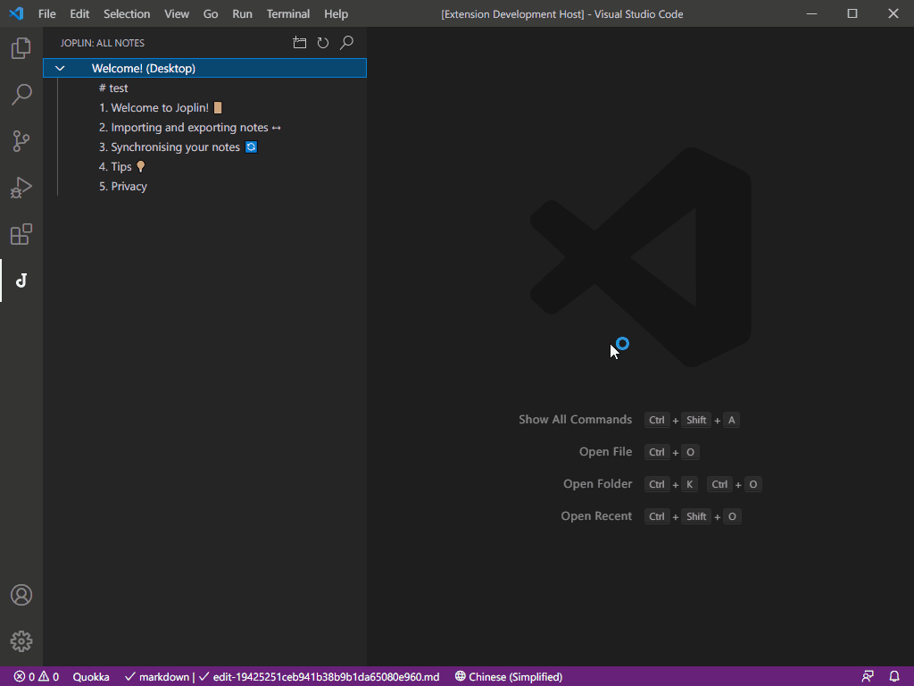

# Other features

## Configuration table

| Field                | Default value  | Options        | Description                                             |
| -------------------- | -------------- | -------------- | ------------------------------------------------------- |
| `token`              |                | `string`       | joplin web server token                                 |
| `programProfilePath` |                | `string`       | Personal directory for joplin programs                  |
| `port`               | `41184`        | `number`       | joplin web service port                                 |
| `deleteConfirm`      | `true`         | `boolean`      | Whether to remind when deleting                         |
| `sortNotes`          | `false`        | `boolean`      | Whether to sort notes.                                  |
| `sortNotesType`      | `alphabetical` |                | Type of sorting notes.                                  |
|                      |                | `alphabetical` | Sort notes by alphabetical order of its Title property. |
|                      |                | `default`      | Default Joplin order (whatever that is).                |
| `sortOrder`          | `asc`          |                | Order of sorting notes (asc or desc)                    |
|                      |                | `asc`          | 'asc': ascending order                                  |
|                      |                | `desc`         | 'desc': descending order (reverse)                      |
| `language`           | `english`      |                | The language displayed by the plugin, follow VSCode     |
|                      |                | `en`           | English                                                 |
|                      |                | `zh`           | Simple Chinese                                          |

## Hot key

- `f2`: Rename notes or directories
- `delete`: delete notes or directories
- `ctrl+alt+u`: upload pictures from clipboard
- `ctrl+alt+e`: upload image from file chooser
- `ctrl+alt+shift+e`: add attachments from the file selector
- `ctrl+j ctrl+o`: search notes

## Paste picture

After `v0.1.7`, a new image paste function has been added. You can upload images to Joplin through the right-click menu, commands or shortcut keys and paste the link into VSCode.

1. `ctrl+alt+u` paste the clipboard picture
2. `ctrl+alt+e` Use the file manager to select the picture and paste

## Add attachments

After `v0.1.10`, the function of adding attachments has been added. You can add files as attachment resources to Joplin notes through commands or shortcut keys.

1. `ctrl+alt+shift+e` select the file to be added as an attachment

## Link notes

You can see **Copy Link** in the right-click menu on the notes, click it to copy it to the clipboard.

Use `Ctrl+click` to open to other notes.
