# i18next-typescript-generator

## 简介

i18next 的 typescript 类型定义生成器，可以从多个语言翻译 json 文件中生成类型定义，支持嵌套对象与参数。

## 使用

```shell
$ i18next-dts-gen -h
Usage: bin [options] [command]

Options:
  -h, --help      display help for command

Commands:
  gen [options]   根据 json 生成 .d.ts 类型定义
  help [command]  display help for command
```

示例

```shell
i18next-dts-gen gen --input src/__tests__/i18n # 扫描这个目录下的 json 文件并生成 index.d.ts 类型定义
```

## 动机

为什么已经有了很多第三方的类型定义生成器，甚至最新版 i18next 官方已经推出了 typescript 解决方案，吾辈还要写这个呢？

简而言之，都不完善。

先从 i18next 官方的解决方案说起，它是将 json 文件替换为 ts 文件，但不能支持参数和嵌套对象。

> 注：最新版似乎利用了 typescript 4.2 的递归类型和模板字符串类型来保证类型安全，但这实际上是不怎么好用的。另外只有 react-i18next 是可用的。
>
> - [i18next typescript support](https://react.i18next.com/latest/typescript)
> - [StackOverflow i18next 的类型定义](https://stackoverflow.com/questions/58277973/how-to-type-check-i18n-dictionaries-with-typescript/58308279#58308279)

再来说 [i18next-typescript](https://github.com/LFDM/i18next-typescript) 这个第三方库，几乎能满足吾辈的需求了，除了一点：支持对象参数。还有像是 Jack 菊苣的 [i18n-codegen](https://github.com/Jack-Works/i18n-codegen)，代码设计上非常优雅，但同样的，不支持 react 之外的生态。

另外，就吾辈而言，认为使用生成器生成简单的类型要比从类型系统上支持这种功能更加容易，也更加合理。

## 设计




## FAQ

### 是否支持 i18next 的全部特性？

否，这里支持的仅为 i18next 的一个子集。

- [x] 为多个本地化 json 配置文件生成类型定义
- [x] 支持包含参数
  - [ ] 不支持对象参数
- [x] 支持嵌套的 key
- [ ] 不支持配置命名空间、嵌套的分割字符串，我们认为约定大于配置
- [ ] 不支持 json 之外的配置文件，我们认为 json 文件对于非开发者都更友好，而且在需要时开发者更容易处理
- [ ] 不支持 i18next 命名空间，即将翻译文件分割
